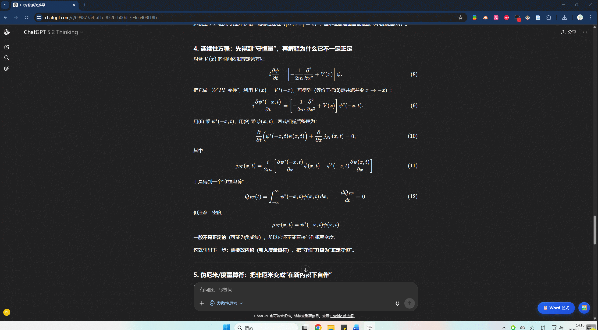
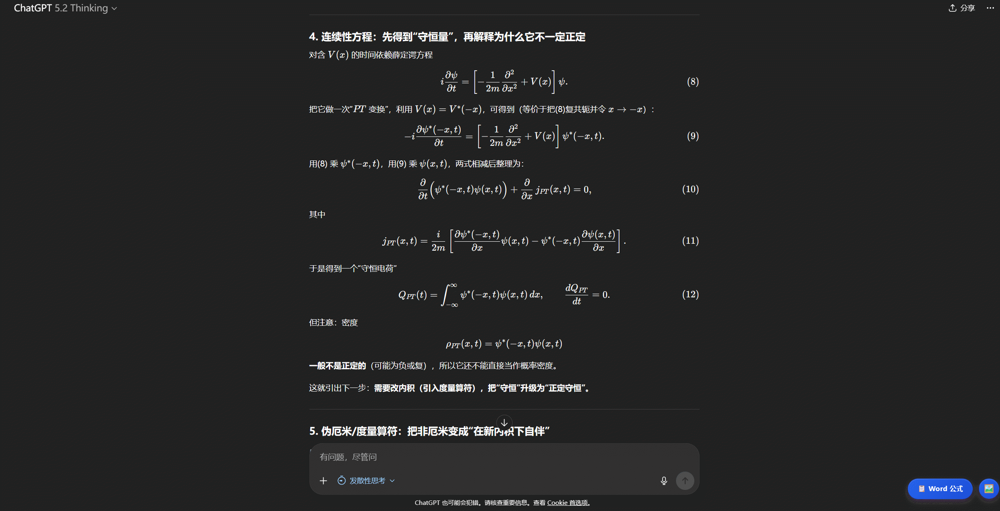
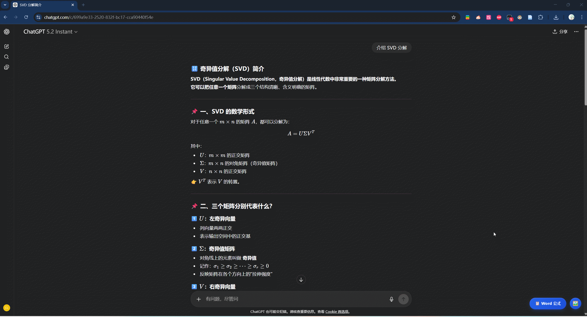

# InkFlow AI: 一键复制大模型公式 & 导出对话图片

这是一个 Tampermonkey 脚本，安装后，你可以在 ChatGPT、Gemini 等网站中：

✅ 双击复制公式（支持 Word 公式 / LaTeX）  
✅ 一键导出对话为高清 PNG 图片

无需注册，无需配置，安装即可使用。

## 功能演示

### Word 公式复制

### LaTeX 复制

### 对话导出 PNG

## 一、安装方法

👉 Greasy Fork 安装地址：[点击安装](https://greasyfork.org/zh-CN/scripts/566889)

安装步骤：

1. 先安装浏览器扩展「Tampermonkey（油猴）」
2. 打开上方链接
3. 点击“安装此脚本”
4. 刷新支持网站即可使用

## 二、支持网站

目前支持以下网站：

- chatgpt.com
- gemini.google.com
- deepseek.com
- wikipedia.org
- zhihu.com
- stackexchange.com

后续会持续扩展。

## 三、如何使用

### 1️⃣ 复制公式

步骤：

1. 打开支持的网站（如 ChatGPT）
2. 右下角选择复制模式：
   - `Word 公式` → 复制为 MathML（直接粘贴到 Word 公式中）
   - `LaTeX | Markdown` → 复制为 LaTeX 文本
3. 双击页面中的公式
4. 粘贴到 Word / Markdown 编辑器即可

### 2️⃣ 导出 ChatGPT 对话为图片

1. 打开 ChatGPT 对话页面
2. 点击右下角“导出”按钮
3. 等待进度条完成
4. 自动下载高清 PNG 图片

适合：

- 保存重要对话
- 发朋友圈 / 发群
- 存档学习笔记

## 四、2.0 版本升级内容

相比旧版本，2.0 做了全面优化：

- 高分辨率分段渲染（超清导出）
- 导出进度百分比显示
- 脚本结构重构，运行更流畅

长对话导出稳定性显著提升。

## 五、常见问题

### 为什么导出比较慢？

对话越长、代码块越多，渲染时间越久。

建议等待导出时摸鱼

### 为什么 Word 粘贴效果偶尔不一致？

原因可能包括：

- 不同网站公式结构不同
- Word 对 MathML 的兼容性差异

## 六、隐私说明

- 不会上传你的对话内容
- 不会上传公式数据
- 所有操作都在本地浏览器中完成

## 七、反馈与建议

如遇到问题或有功能建议：

请通过项目仓库的 `Issues` 页面提交反馈。

## 八、开发者说明

本节面向仓库贡献者与二次开发者。

### 1️⃣ 技术栈与构建方式

- 源码：`src/*.js`（按功能模块拆分）
- 构建器：Rollup
- 输出：`main.user.js`（单文件 userscript，可直接发布/安装）
- 压缩：Terser（已启用）
- 元信息来源：`src/meta.user.js`

> `main.user.js` 为构建产物，建议通过构建生成，不手工改动。

### 2️⃣ 目录结构（核心）

- `src/main.js`：入口与事件绑定
- `src/chatgpt-export.js`：对话导出与渲染流程
- `src/stitch.js`：分段导出后的拼接逻辑
- `src/ui.js`：按钮、提示、进度 UI
- `src/mathml.js`：MathML 提取与 Word 兼容归一化
- `src/site-targets.js`：站点公式选择器适配
- `src/meta.user.js`：Userscript 元信息块
- `rollup.config.mjs`：打包配置

### 3️⃣ 本地开发

1. 安装 Node.js（建议 LTS）
2. 安装依赖：
   - `npm install`
3. 构建：
   - `npm run build`
4. 监听构建：
   - `npm run build:watch`

构建后会自动生成最新 `main.user.js`。

### 4️⃣ VS Code 一键构建

仓库已提供任务配置 `.vscode/tasks.json`：

- 执行默认 Build 任务即可触发 `npm run build`

### 5️⃣ 调试建议（油猴）

1. 在 Tampermonkey 中安装本地 `main.user.js`
2. 每次修改源码后执行 `npm run build`
3. 刷新目标页面验证功能

### 6️⃣ 发布流程（建议）

1. 更新版本号（`package.json` 与 `src/meta.user.js`）
2. 执行 `npm run build`
3. 提交并推送代码
4. 打 tag（例如 `v2.0.1`）并 push tag
5. 使用 GitHub Release 发布说明

## License

GNU GPL v3  
详见 LICENSE 文件。
